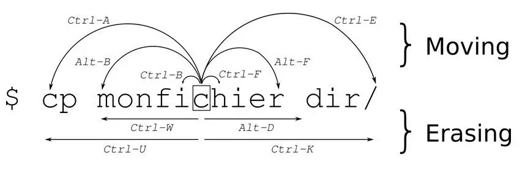

# Bash 快捷鍵

紀錄常用的快捷鍵，僅記錄常被使用的。

### 游標移動

* `Ctrl` + `a` 將游標移動到行首
* `Ctrl` + `e` 將游標移動到行尾
* `Alt` + `f` 往後移動一個單詞
* `Alt` + `b` 往前移動一個單詞
* `Ctrl` + `xx` 在游標處和行首間來回

### 剪下、刪除、貼上

* `Ctrl` + `l` 清除屏幕\(使用此方法清除而不是輸入 clear ，因為會寫入命令執行紀錄\)
* `Ctrl` + `u` 剪下行首至游標處的文字，存入剪貼簿
* `Ctrl` + `k` 剪下游標處至行尾的文字，存入剪貼簿
* `Ctrl` + `w` 剪下游標處至單詞字首，存入剪貼簿
* `Alt` + `d` 剪下游標處至單詞字尾，存入剪貼簿
* `Ctrl` + `y` 貼上剪貼簿中的文字

### 文字處理

* `Alt` + `u` 更改游標處後的單詞為全部大寫
* `Alt` + `l` 更改游標處後的單詞為全部小寫
* `Alt` + `c` 更改游標處單詞字首大寫其他小寫
* `Alt` + `t` 交換游標處前與後的單詞，若游標在行尾交換最後兩個單詞

### 命令執行紀錄

* `Ctrl` + `r` 進入搜尋命令執行紀錄模式
* `Ctrl` + `o` 直接執行搜尋匹配的紀錄命令\(如果不需要直接執行仍保留命令，按下 Ctrl + e 將游標移動至最後即可\)
* `Ctrl` + `g` 退出搜尋命令執行紀錄模式\(不會印出搜尋匹配的命令\)
* `Alt` + `.` 使用上一個命令的單詞

### 命令操作

* `Ctrl` + `z` 中斷當前執行的命令使它待命\(配合之後鍵入 bg 命令使它在背景運行\)
* `Ctrl` + `c` 終止當前執行的命令
* `Ctrl` + `s` 終止輸出到屏幕
* `Ctrl` + `q` 允許輸出到屏幕
* `!!` 重複執行最後一個命令

